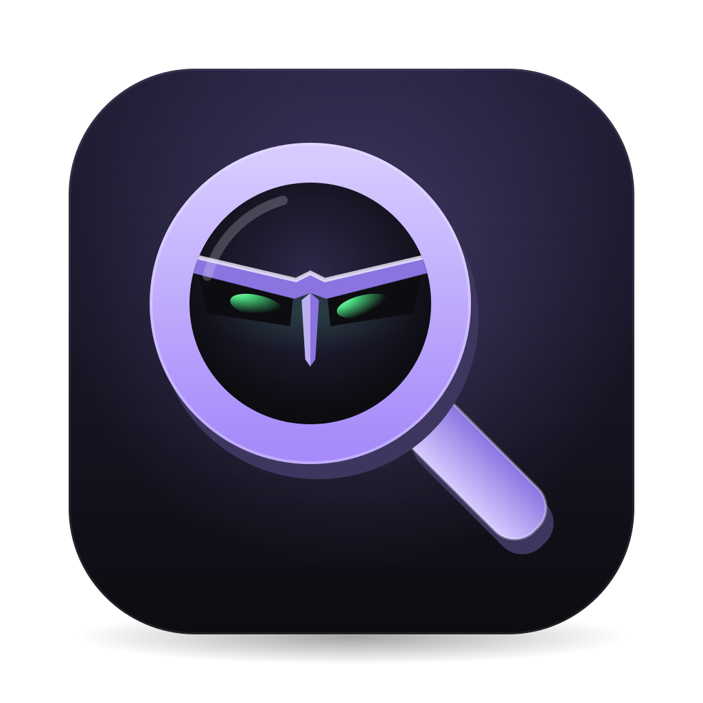

<p align="center"></p>

# Villain Caster

Minimal Spotlight/Raycast replacement for macOS. Only the features you actually use.

A menu bar app that opens a Liquid Glass launcher panel on ⌘Space. No file
search on purpose, no API keys, no accounts, no telemetry, no dependencies
beyond AppKit.

## Features

Type `help` (or `?`) in the launcher for this list in-app.

| Input | Does |
|-------|------|
| `wez` | Fuzzy app search, ⏎ launches |
| `33 / 3` | Calculator — `+ - * / % ^ ( )`, result inline, ⏎ copies |
| `32 sek to eur` | Currency — codes, names or symbols (`5 euro to dollar`); ECB rates via frankfurter.dev, exotic currencies via open.er-api.com |
| `time in tokyo` | World clock — tz cities, `nyc`, `cet`; bare `time` = local |
| `weather` | Current conditions + next 3 days (ipapi.co + open-meteo.com) |
| `emoji shrug` | Emoji search, ⏎ copies |
| `g` / `yt` / `gh` + query | Web search — Google, YouTube, GitHub |
| `work email` | Snippets — copy your emails/phone/address; set values via menu bar icon → Settings… |
| `maximize` | Resize the focused window to the monitor minus the menu bar¹ |
| `move window` | Send focused window to next display (only with 2+ monitors)¹ |
| `sleep` / `lock` / `trash` / `dark` | Sleep Mac, lock screen, empty trash², toggle dark mode² |
| `quit` | Quit Villain Caster |
| *(empty)* | Your 3 most-used items (frecency: usage count with 7-day half-life) |

¹ needs Accessibility permission — ² needs a one-time Automation approval

## Requirements

- macOS 27 or later
- Xcode 27 / Swift 6.4 toolchain (`swift --version`)

## Build & run

```sh
make run        # build + run directly (dev)
make app        # build "build/Villain Caster.app"
make install    # copy to /Applications and start it
make icon       # re-render Resources/AppIcon.icns after editing AppIcon.svg
make clean      # remove build output
```

There are no prebuilt binaries; build from source.

### Code signing (optional)

`make app` signs ad-hoc by default. macOS ties permission grants
(Accessibility, Screen Recording) to the signature, so with ad-hoc signing
you have to re-grant them after every rebuild. To avoid that, create a
self-signed code signing certificate named **`VillainCaster Dev`** in
Keychain Access (Certificate Assistant → Create a Certificate… → Certificate
Type: Code Signing). The Makefile picks it up automatically when present.

## Important: free up ⌘Space

Spotlight owns ⌘Space by default. Disable it first:

System Settings → Keyboard → Keyboard Shortcuts… → Spotlight →
uncheck "Show Spotlight search".

Then start Villain Caster.

## Keys

| Key | Action |
|-----|--------|
| ⌘Space | toggle panel |
| ↑ / ↓ | move selection |
| ⏎ | launch app / copy result |
| Esc | close |
| ⌘S / ⌘⇧S | save screenshot of the panel to Desktop³ |

³ with Screen Recording permission the glass blur is captured; without it you
get a flat render of the panel

Left-click the mask in the menu bar to toggle the panel; right-click it for
Settings… and Quit.

## Permissions

| Permission | Used for |
|------------|----------|
| Accessibility | `maximize`, `move window` |
| Automation → Finder | `trash`, reopening Finder windows |
| Automation → System Events | `dark` |
| Screen Recording (optional) | ⌘S screenshots with blur |

Each one is requested only the first time you use the feature that needs it.

## Privacy

Everything runs locally except these lookups, which only happen when you
type the matching query:

| Query | Service | What's sent |
|-------|---------|-------------|
| currency | [frankfurter.dev](https://frankfurter.dev), [open.er-api.com](https://www.exchangerate-api.com/docs/free) | currency codes and amount |
| `weather` | [ipapi.co](https://ipapi.co) | your IP address (to estimate your location) |
| `weather` | [open-meteo.com](https://open-meteo.com) | approximate latitude/longitude |
| `g` / `yt` / `gh` | Google, YouTube, GitHub | your search, opened in your browser |

Snippet values and usage history (for ranking) are stored locally in
UserDefaults (`com.villain.villaincaster`). `make run` starts the bare binary,
which uses its own defaults domain, so it doesn't share those with the
installed app.

## Autostart

System Settings → General → Login Items → add `/Applications/Villain Caster.app`.

## Contributing

Issues and pull requests are welcome. The scope is intentionally small, so
please open an issue before starting on a new feature. Commit messages follow
[Conventional Commits](https://www.conventionalcommits.org) (`feat:`,
`fix:`, `build:`, …).

## License

[MIT](LICENSE)
